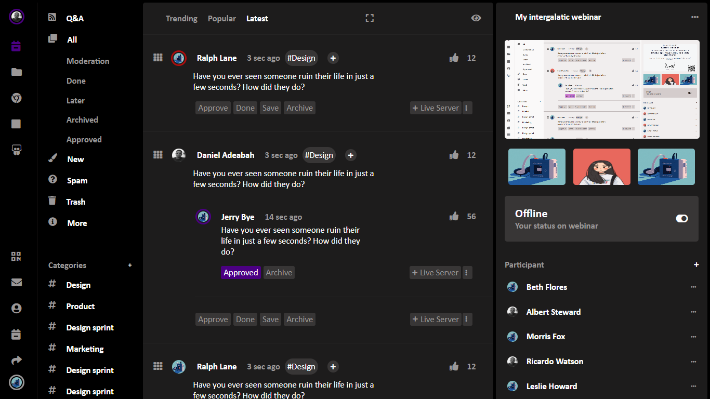
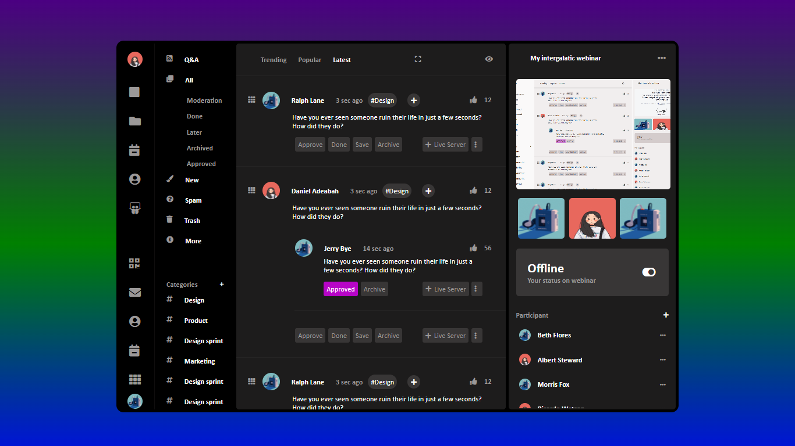
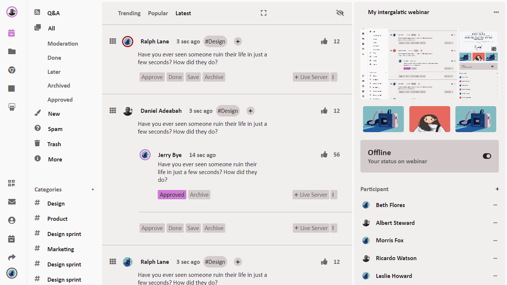
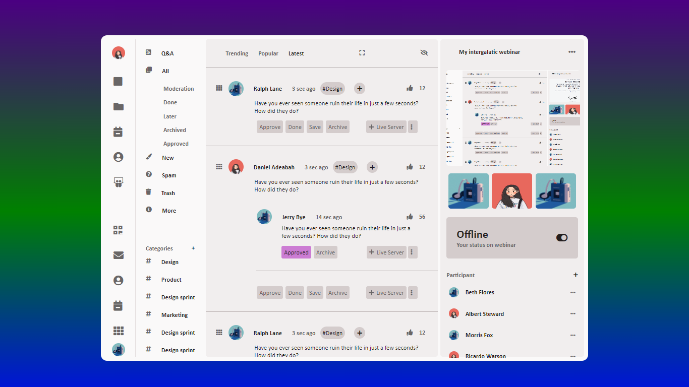

# slack_QA-desktop-clone

I created this Slack_QA-desktop-clone UI as part of a challenge with friends. This one, I downloaded a UI on Pinterest app and challenged myself.

## Downloaded Pinterest UI

## Screenshots of what I built

### Dark-mode

### Light-mode

- Please give me a star for my works, Thank you.